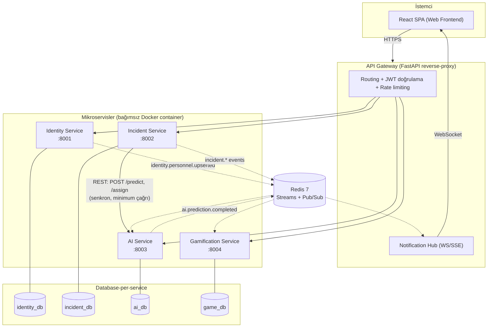
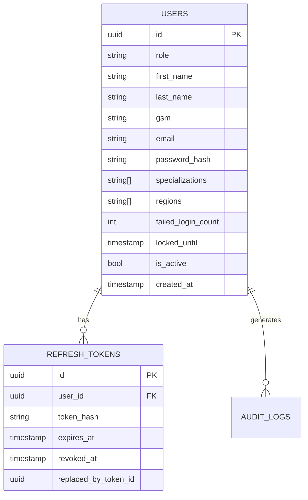
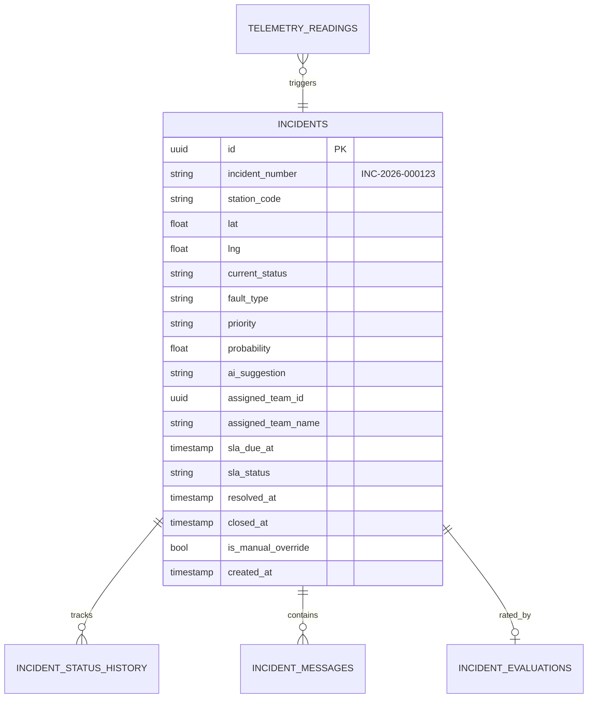
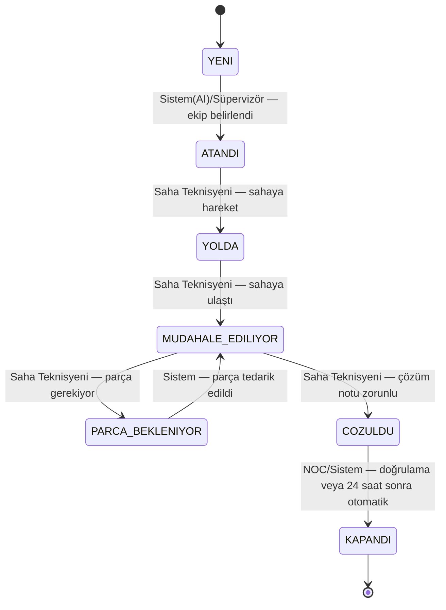
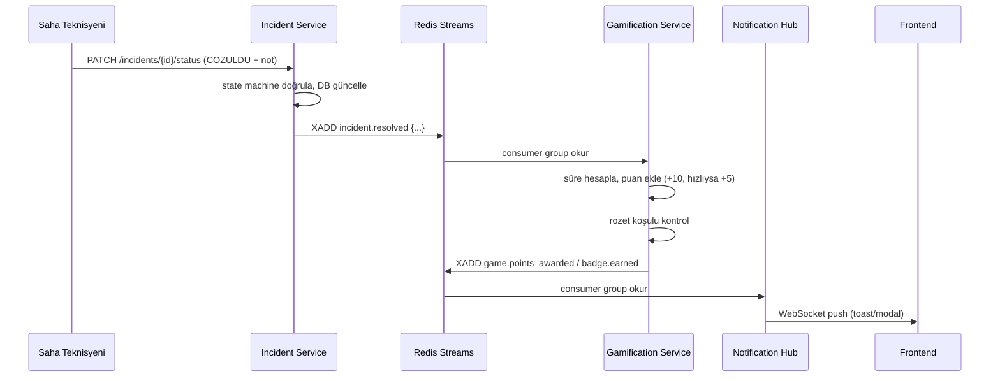
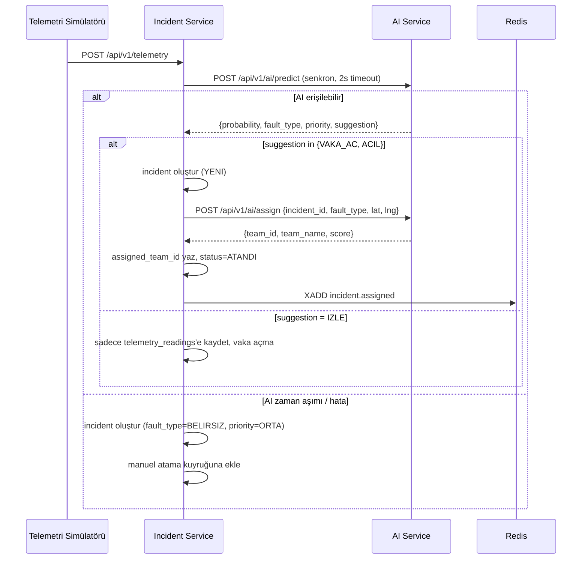

# NetOpsCell — Mimari Tasarım Dokümanı

**Case:** Turkcell CodeNight 2026 Final — NetOpsCell (Şebeke Arıza Tahmini ve Saha Operasyon Platformu)
**Seçilen Yaklaşım:** Seçenek A — FastAPI + PostgreSQL (servis başına) + Redis (event bus) + React web frontend

---

## 0. Yönetici Özeti ve Teknoloji Kararı

| Katman | Teknoloji | Gerekçe |
|---|---|---|
| Backend (4 servis) | **Python 3.12 + FastAPI + Pydantic v2 + SQLAlchemy 2.0 (async) + Alembic** | 4 servis de aynı iskelet: hız, otomatik OpenAPI/Swagger (10 puanlık dokümantasyon kriterinin çoğu bedava gelir), async I/O ile LLM/HTTP çağrılarını bloklamadan yönetme. |
| Veritabanı | **PostgreSQL 16**, servis başına ayrı container + ayrı volume | Database-per-service kuralı zorunlu; tek DB engine kullanmak takımın öğrenme eğrisini düşürür. |
| Event Bus | **Redis 7** — Streams (consumer groups) + Pub/Sub karışımı | Bonus kriterinde adı geçen teknoloji; RabbitMQ/Kafka'ya göre kurulum yükü çok düşük. Redis Streams, event'lerin kalıcı ve tekrar okunabilir olmasını sağlar (aşağıda gerekçesi var). |
| API Gateway | **Kendi yazdığımız FastAPI reverse-proxy** (httpx tabanlı) | Stack'i tek dilde tutar; JWT doğrulama + rate limiting + routing kendi kodumuzda, Kong gibi ek bir altyapı öğrenmeye gerek yok. |
| AI yaklaşımı | **(c) LLM API entegrasyonu** (Anthropic Claude, structured output / tool use) + deterministik kural tabanlı fallback | Kullanıcının tercihi. Aşağıda Bölüm 8'de tüm detay var. Not: Bu seçim, kendi eğitilmiş ML modeli bonusunu (+8) hedeflemez; onun yerine mesaj kuyruğu (+5), kategori bazlı doğruluk kırılımı (+3) ve gerçek zamanlı bildirim (+2) bonuslarına odaklanılır. |
| Frontend | **React 18 + Vite + TypeScript + TailwindCSS + React Query + Zustand** | "Basit web frontend" hedefiyle uyumlu, hızlı kurulan, tek sayfa uygulaması. |
| Deployment | **Docker Compose**, tek `docker compose up` | Zorunlu kural. |

---

## 1. Yüksek Seviye Mimari



**Kritik mimari kural:** Servisler birbirinin veritabanına asla doğrudan erişmez. Servisler arası ihtiyaç duyulan veri ya (a) event ile senkronize edilen yerel bir *read-model/cache* tablosunda tutulur, ya da (b) JWT claim'leri üzerinden taşınır, ya da (c) zorunlu anlarda (telemetri → tahmin gibi) minimum, senkron REST çağrısıyla sağlanır.

---

## 2. Repository Yapısı (Monorepo)

```
netopscell/
├── docker-compose.yml
├── .env.example
├── README.md
├── EVENTS.md
├── docs/
│   └── ai-approach.md              # AI yaklaşım dokümanı (bkz. Bölüm 8)
├── gateway/
│   ├── app/ (main.py, routing.py, auth_middleware.py, rate_limit.py, notification_hub.py)
│   ├── Dockerfile
│   └── README.md
├── services/
│   ├── identity-service/
│   │   ├── app/ (api/, models/, schemas/, core/, events/)
│   │   ├── alembic/
│   │   ├── Dockerfile
│   │   ├── .env.example
│   │   └── README.md
│   ├── incident-service/  (aynı iskelet)
│   ├── ai-service/        (aynı iskelet + app/llm/)
│   └── gamification-service/ (aynı iskelet)
└── frontend/
    ├── src/ (pages/, features/, api/, store/, components/)
    ├── Dockerfile
    └── README.md
```

Her servis birbirinden bağımsız `pyproject.toml`/`requirements.txt` ile kendi container'ında build edilir; ortak kod (JWT decode helper'ı, event şema tipleri gibi) küçük bir `shared/` paketi olarak her serviste kopyalanır ya da bir dahili pip paketi olarak (aşırı mühendislikten kaçınmak için hackathon kapsamında **kopyalamak yeterlidir**).

---

## 3. Kimlik ve Rol Modeli

Case dokümanındaki 3.3 yetki matrisi tablosu PDF çıktısında bozulmuş göründüğü için (OCR/kolon kayması), roller 1.2 ve 3.1'deki akış tanımlarından yeniden inşa edilmiştir:

| Rol | Kod | Kayıt Yöntemi | Özet Yetki |
|---|---|---|---|
| Müşteri | `MUSTERI` | GSM + OTP (sabit kod `1234`) | Sadece kendi bildirdiği/ilişkili kayıtları görebilir. |
| Saha Teknisyeni | `SAHA_TEKNISYENI` | Admin oluşturur (e-posta+şifre) | Kendine atanan vakaları görür, durum günceller, çözüm notu yazar. |
| NOC Operatörü | `NOC_OPERATORU` | Admin oluşturur | Tahminleri görür, vaka açar/doğrular, tür/öncelik değiştirebilir, çözüm değerlendirir. |
| Süpervizör | `SUPERVIZOR` | Admin oluşturur | Dashboard, manuel atama, tüm kayıtlara erişim, tür/öncelik override. |
| Admin | `ADMIN` | Sistem tohumlama (seed) | Personel hesabı oluşturma, rol yönetimi, audit log görüntüleme. |

### 3.1 Rol/Yetki Matrisi (endpoint seviyesinde uygulanır)

| İşlem | Müşteri | Saha Teknisyeni | NOC Operatörü | Süpervizör | Admin |
|---|:---:|:---:|:---:|:---:|:---:|
| Arıza oluşturma (telemetri/form) | ✗ | ✗ | ✓ | ✓ | ✓ |
| Kendi kayıtlarını görme | ✓ (kendi) | ✓ (atanan) | ✓ (tümü) | ✓ (tümü) | ✓ (tümü) |
| Durum değiştirme | ✗ | ✓ (kendi vakası, state machine'e uygun) | ✓ | ✓ | ✗ |
| Manuel atama | ✗ | ✗ | ✗ | ✓ | ✓ |
| Kategori/tür değiştirme (AI override) | ✗ | ✗ | ✓ | ✓ | ✗ |
| Dashboard görüntüleme | ✗ | ✗ | ✗ | ✓ | ✓ |
| Personel hesabı oluşturma | ✗ | ✗ | ✗ | ✗ | ✓ |
| Audit log görüntüleme | ✗ | ✗ | ✗ | ✗ | ✓ |

Yetkisiz erişim denemesi → **403** + Identity Service'e audit log yazımı (bkz. 3.4).

### 3.2 JWT Payload Tasarımı

```json
{
  "sub": "user_id (uuid)",
  "role": "SAHA_TEKNISYENI",
  "specializations": ["DONANIM", "ISINMA"],
  "regions": ["IST-AVRUPA"],
  "token_type": "access",
  "iat": 1753180800,
  "exp": 1753181700
}
```

- **Access token:** RS256 imzalı, 15 dk geçerli. Gateway, Identity'nin **public key**'i ile imzayı doğrular (Identity'nin private key'ine ya da DB'sine ihtiyaç duymadan) — böylece Gateway/servisler arası senkron bağımlılık oluşmaz.
- **Refresh token:** Opaque random string (JWT değil), `identity_db.refresh_tokens` tablosunda **hash'lenmiş** olarak saklanır, 7 gün geçerli.
- **Token rotation:** Her `/refresh` çağrısında eski token `revoked_at` ile işaretlenir, yeni token üretilir ve `replaced_by_token_id` ile zincirlenir. Zaten `revoked_at` dolu bir token tekrar kullanılmaya çalışılırsa → **token theft** kabul edilir, o kullanıcının **tüm** refresh token'ları iptal edilir, ilgili audit log kritik seviyede yazılır, kullanıcı yeniden login olmak zorunda kalır.

### 3.3 Şifre Politikası ve Hesap Kilitleme

- Min 8 karakter, ≥1 büyük harf, ≥1 rakam, ≥1 özel karakter. İhlalde `422` + hangi kuralın ihlal edildiğini belirten alan bazlı hata (`{"success": false, "error": {"code": "WEAK_PASSWORD", "violations": ["min_length", "special_char"]}}`).
- Hash: **argon2** (passlib `argon2` — bcrypt'e göre GPU brute-force'a karşı daha dirençli; ikisi de kabul edilir kuralına uygun).
- 5 başarısız giriş → 15 dakika kilit. Kilitli hesaba giriş denemesinde kalan süre `423 Locked` + `{"retry_after_seconds": N}` döner.

### 3.4 Audit Log Şeması (`identity_db.audit_logs`)

| Alan | Açıklama |
|---|---|
| `user_id` | Kim (nullable — başarısız login'de henüz kimlik yoksa gsm/email saklanır) |
| `action_type` | `LOGIN_SUCCESS`, `LOGIN_FAILURE`, `ACCOUNT_LOCKED`, `ROLE_CHANGED`, `UNAUTHORIZED_ACCESS`, `INCIDENT_DELETED`, `CRITICAL_STATUS_CHANGE`, ... |
| `resource_type` / `resource_id` | Ne üzerinde (örn. `incident`, `INC-2026-000123`) |
| `ip_address` | Nereden |
| `result` | `SUCCESS` / `FAILURE` |
| `detail` | JSONB serbest alan |
| `created_at` | Ne zaman |

`403` dönen her istek, ilgili servis tarafından senkron REST ile değil — **basitlik için doğrudan Identity Service'in `POST /internal/audit`** endpoint'i (gateway dışı, sadece iç ağdan erişilebilir) çağrılarak loglanır. Bu, event bus'a yük bindirmeden hızlı ve senkron bir güvenlik kaydı sağlar.

---

## 4. Servis Detayları

### 4.1 Identity Service (`identity_db`)

**Tablolar:** `users`, `refresh_tokens`, `otp_codes`, `audit_logs`



**Endpoint listesi:**

| Method | Endpoint | Rol | Açıklama |
|---|---|---|---|
| POST | `/api/v1/auth/register/customer` | Public | Ad, soyad, GSM, e-posta(opsiyonel) → OTP gönderir |
| POST | `/api/v1/auth/otp/verify` | Public | `{gsm, code}` → hesap aktive, token çifti döner |
| POST | `/api/v1/auth/otp/resend` | Public | Yeni OTP (simülasyon: her zaman `1234`) |
| POST | `/api/v1/auth/personnel` | Admin | Personel hesabı oluşturur (rol, uzmanlık, bölge atanır) |
| POST | `/api/v1/auth/login` | Public | E-posta+şifre (personel) veya GSM+OTP (müşteri) |
| POST | `/api/v1/auth/refresh` | Public (refresh token ile) | Token rotation |
| POST | `/api/v1/auth/logout` | Authenticated | Refresh token iptali |
| GET | `/api/v1/auth/me` | Authenticated | JWT'den profil |
| GET | `/api/v1/auth/users` | Admin, Süpervizör | Filtreli personel listesi |
| GET | `/api/v1/auth/users/{id}` | Self / Admin / Süpervizör | Kullanıcı detay |
| PATCH | `/api/v1/auth/users/{id}` | Admin | Rol/uzmanlık/bölge/aktiflik güncelle → `identity.personnel.upserted` event yayınlar |
| GET | `/api/v1/auth/audit-logs` | Admin | Filtreli audit log (user, action, tarih aralığı) |
| POST | `/internal/audit` | Internal-only (gateway dışı ağ) | Diğer servislerden 403 audit kaydı |

---

### 4.2 Incident Service (`incident_db`)

**Tablolar:** `incidents`, `telemetry_readings`, `incident_status_history`, `incident_messages`, `incident_resolution_notes`, `incident_evaluations`



**Arıza numarası üretimi:** `INC-{yıl}-{6 haneli sequence}` — Postgres `SEQUENCE` ile üretilir (çakışmasız, okunabilir).

#### 4.2.1 Durum Makinesi (State Machine)



- Grafta **olmayan** bir geçiş denemesi → **422 Unprocessable Entity** (`{"error": {"code": "INVALID_TRANSITION", "from": "...", "to": "..."}}`).
- Graftaki geçerli bir geçiş ama **yetkisiz rol/kişi** tarafından denenmesi (örn. atanan teknisyen olmayan biri, ya da müşteri) → **403**.
- `COZULDU` geçişinde `resolution_note` zorunlu (aynı `PATCH` gövdesinde ya da önceden `POST /resolution-note` ile girilmiş olmalı).
- `KAPANDI` geçişi: NOC operatörü manuel onaylar **veya** arka planda çalışan zamanlanmış görev, `COZULDU` durumunda 24 saat geçmiş kayıtları otomatik `KAPANDI` yapar.

#### 4.2.2 SLA Takibi

| Öncelik | Süre | Aşım Etkisi |
|---|---|---|
| KRITIK | 1 saat | Vaka kırmızı + Süpervizör panelinde en üstte |
| YUKSEK | 4 saat | Turuncu işaret |
| ORTA | 12 saat | Görsel uyarı |
| DUSUK | 48 saat | Görsel uyarı |

`sla_due_at = created_at + süre`. `COZULDU` durumuna geçince sayaç durur (`sla_status = MET` ya da `BREACHED`, artık değişmez). Incident Service içinde `asyncio` tabanlı periyodik bir arka plan görevi (30 sn'de bir) `sla_due_at < now() AND current_status NOT IN (COZULDU, KAPANDI) AND sla_status = 'ACTIVE'` olan kayıtları `BREACHED` işaretler ve `incident.sla_breached` event'i yayınlar.

#### 4.2.3 Endpoint Listesi

| Method | Endpoint | Rol | Açıklama |
|---|---|---|---|
| POST | `/api/v1/telemetry` | NOC, Admin (veya simülatör script'i) | Telemetri girişi → AI Service'e senkron `predict` çağrısı → eşik değere göre vaka oluşturur |
| GET | `/api/v1/incidents` | Herkes (rol bazlı scope) | Filtreler: `status`, `priority`, `fault_type`, `station_code`, `assigned_to_me`, tarih aralığı |
| GET | `/api/v1/incidents/{id}` | Sahiplik/rol kontrolü (IDOR koruması) | Detay |
| PATCH | `/api/v1/incidents/{id}/status` | State machine + rol kontrolü | Durum güncelle |
| PATCH | `/api/v1/incidents/{id}/assign` | Süpervizör, Admin | Manuel atama override |
| PATCH | `/api/v1/incidents/{id}/fault-type` | NOC, Süpervizör | AI override → `incident.type_changed` |
| PATCH | `/api/v1/incidents/{id}/priority` | Süpervizör | Manuel öncelik değişimi |
| POST | `/api/v1/incidents/{id}/messages` | Atanan teknisyen / NOC | Thread mesajı |
| GET | `/api/v1/incidents/{id}/messages` | Aynı | Thread listesi |
| POST | `/api/v1/incidents/{id}/resolution-note` | Saha Teknisyeni | Çözüm notu (COZULDU ön koşulu) |
| POST | `/api/v1/incidents/{id}/evaluation` | NOC Operatörü | 1-5 yıldız, tek seferlik → `incident.evaluated` |
| GET | `/api/v1/incidents/queue/unassigned` | Süpervizör | BELİRSİZ / kapasite bekleyen kuyruk |
| GET | `/api/v1/incidents/stats/summary` | Süpervizör, Admin | Dashboard agregasyonları (tür/öncelik dağılımı, SLA uyum oranı) |

**AI erişilemezse davranış:** `POST /api/v1/ai/predict` çağrısı `httpx` ile 2 sn timeout + 1 retry yapılır; hâlâ başarısızsa vaka `fault_type=BELIRSIZ`, `priority=ORTA`, `assigned_team_id=null` ile oluşturulur ve manuel atama kuyruğuna düşer — servis **hiçbir zaman** 500 dönüp isteği reddetmez.

---

### 4.3 AI Service (`ai_db`)

Bu servis case'in kalbi — detaylı LLM entegrasyonu **Bölüm 8**'de.

**Tablolar:** `predictions`, `accuracy_feedback`, `team_profile` *(Identity'den event ile senkronize read-model)*, `team_workload` *(Incident'ten event ile senkronize)*, `assignment_log`.

#### Endpoint Listesi

| Method | Endpoint | Çağıran | Açıklama |
|---|---|---|---|
| POST | `/api/v1/ai/predict` | Incident Service (senkron) | Telemetri → `{probability, fault_type, priority, suggestion, method, confidence_explanation}` |
| POST | `/api/v1/ai/assign` | Incident Service (senkron, vaka oluşturulduktan sonra) | `{incident_id, fault_type, priority, lat, lng}` → `{team_id, team_name, score, components}` |
| GET | `/api/v1/ai/predictions` | Süpervizör (dashboard) | Geçmiş tahminler, filtreli |
| GET | `/api/v1/ai/accuracy?breakdown=category` | Süpervizör, Admin | `doğru/toplam*100` + kategori bazlı kırılım (bonus +3) |
| GET | `/api/v1/ai/teams` | Süpervizör, Admin | Cache'lenmiş ekip roster + iş yükü (demo şeffaflığı için) |

`POST /predict` ve `POST /assign` neden ayrı: Görev 1+2 (tahmin+sınıflandırma) tek LLM çağrısında birlikte döner (aynı çıktının parçaları); Görev 3 (atama) tamamen deterministik bir skorlama algoritmasıdır ve vaka gerçekten oluşturulduktan **sonra** çalışır. Bu ayrım hem "clean code/SOLID" hem de LLM'in *sadece* belirsizlik gerektiren kısımda kullanılmasını sağlar.

---

### 4.4 Gamification Service (`game_db`)

**Tablolar:** `point_ledger`, `user_stats`, `badges`, `user_badges`

Bu servis **hiçbir REST çağrısıyla tetiklenmez** — sadece Redis event tüketicisi olarak çalışır (case'in "olay tabanlı mimari beklenir" şartı).

| Method | Endpoint | Rol | Açıklama |
|---|---|---|---|
| GET | `/api/v1/game/profile/me` veya `/{user_id}` | Self / Süpervizör / Admin (IDOR koruması) | Toplam puan, seviye, rozetler, çözülen vaka, ortalama puan, sıralama |
| GET | `/api/v1/game/leaderboard?period=daily\|weekly&limit=10` | Herkes | İlk 10, puan sıralı |
| GET | `/api/v1/game/badges` | Herkes | Rozet kataloğu |
| GET | `/api/v1/game/ledger/{user_id}` | Self / Admin | Puan geçmişi (şeffaflık) |

**Puan hesaplama:** `point_ledger`'a her event için satır eklenir; `user_stats` (toplam puan, seviye) **transaction içinde** güncellenir. Leaderboard, `point_ledger` üzerinde `created_at` aralığına göre `SUM(points) GROUP BY user_id ORDER BY DESC LIMIT 10` sorgusuyla **her zaman anlık doğru** hesaplanır; performans için Redis'te 5 saniyelik TTL cache kullanılır (yeni puan geldiğinde cache invalide edilir) — "gerçek zamanlı veya sayfa yenilemede güncel" şartını fazlasıyla karşılar.

**Rozet/seviye kontrolü:** Her `point_ledger` insert sonrası ilgili kullanıcının `user_stats`'ı yeniden hesaplanır, rozet koşulları (case Bölüm 6.2) kontrol edilir, yeni kazanılan rozet varsa `badge.earned` event'i yayınlanır (Notification Hub → toast/modal).

**Tekrar eden arıza tespiti:** `incident.created` event'i tüketilir, aynı `station_code` için son 24 saat içinde önceki bir `incident.created` var mı diye `point_ledger`/küçük bir `recent_stations` tablosunda kontrol edilir; varsa ilgili teknisyene -3 ceza uygulanır (case Bölüm 6.1).

---

## 5. API Gateway

Basit bir FastAPI uygulaması; iş mantığı içermez, sadece:

1. **Routing:** Path prefix → hedef servis (yukarıdaki tablo).
2. **JWT doğrulama middleware:** RS256 imza + `exp` kontrolü; geçersizse `401`. Doğrulanan claim'ler `X-User-Id`, `X-User-Role`, `X-User-Specializations`, `X-User-Regions` header'ları olarak downstream servise iletilir (servisler **de** kendi içinde rol kontrolü yapar — defense in depth, sadece Gateway'e güvenilmez).
3. **Rate limiting:** Redis tabanlı sliding-window (`/auth/login` için IP başına 10 istek/dk, genel trafik için IP başına 100 istek/dk). Brute-force testine karşı ilk savunma katmanı.
4. **Notification Hub:** `WS /api/v1/ws/notifications?token=<jwt>` — Redis event kanallarına abone olur, bağlı istemcilere `user_id`/`role`'e göre filtrelenmiş event push eder (`badge.earned`, kendi atanmış `incident.assigned`, süpervizörler için `incident.sla_breached`).
5. **Docker ağ izolasyonu:** Sadece Gateway host'a expose edilir (prod senaryosu); servisler yalnızca `netopscell-net` iç ağında görünür. *(Hackathon demo/geliştirme kolaylığı için tüm servis portları da host'a açık bırakılabilir — her serviste kendi `/docs` Swagger UI'ı görünür olsun diye; bu, jüri değerlendirmesini kolaylaştırır.)*

### 5.1 Gateway Routing Tablosu

| Path Prefix | Hedef |
|---|---|
| `/api/v1/auth/**` | Identity Service |
| `/api/v1/telemetry` | Incident Service |
| `/api/v1/incidents/**` | Incident Service |
| `/api/v1/ai/**` | AI Service |
| `/api/v1/game/**` | Gamification Service |
| `/api/v1/ws/notifications` | Gateway (yerel, Notification Hub) |
| `/health` | Gateway (tüm servislerin health durumunu agregasyon) |

**Standart response formatı** (tüm servislerde ortak Pydantic `ResponseEnvelope`):

```json
{ "success": true, "data": { ... }, "error": null }
{ "success": false, "data": null, "error": { "code": "INVALID_TRANSITION", "message": "..." } }
```

---

## 6. Servisler Arası Event Akışı (Event-Driven Mimari)

### 6.1 Neden Redis Streams (sade Pub/Sub değil)

Ham Redis Pub/Sub "fire-and-forget"tir: event yayınlandığı anda abone olan servis kapalıysa (örn. demo'da `docker stop gamification-service` yapılırsa) event **sonsuza dek kaybolur** — puan asla eklenmez. Bunun yerine **Redis Streams** (`XADD` / `XREADGROUP` consumer group'ları ile) kullanılır: event'ler kalıcıdır, servis yeniden ayağa kalktığında kaldığı yerden okumaya devam eder (`incident.resolved` sırasında Gamification kapalıysa bile, açıldığında puanı kaçırmaz). Bu, hâlâ "Redis üzerinden event tabanlı iletişim" bonus kriterine (+5) tam uyar; sadece API'si `XADD`/`XREADGROUP`'tur, kavramsal olarak pub/sub'ın kalıcı versiyonudur. Basitlik önceliğiyse, ilk günlerde ham Pub/Sub ile başlayıp son gün Streams'e geçmek de mümkündür.

### 6.2 Event Kataloğu

| Event | Yayınlayan | Tüketen | Payload (özet) |
|---|---|---|---|
| `identity.personnel.upserted` | Identity | AI (team_profile cache) | `{user_id, name, specializations[], regions[], base_lat, base_lon, is_active}` |
| `ai.prediction.completed` | AI | (analitik/dashboard, opsiyonel) | `{telemetry_id, probability, fault_type, priority, suggestion, method}` |
| `incident.created` | Incident | Gamification (tekrar arıza tespiti) | `{incident_id, incident_number, station_code, fault_type, priority, probability, created_at}` |
| `incident.assigned` | Incident | AI (workload cache) | `{incident_id, team_id, team_name, score, assigned_by, assigned_at}` |
| `incident.status_changed` | Incident | AI (workload cache) | `{incident_id, from_status, to_status, changed_by, changed_at}` |
| `incident.type_changed` | Incident | AI (doğruluk takibi) | `{incident_id, original_fault_type, new_fault_type, changed_by, changed_at}` |
| `incident.priority_changed` | Incident | — (audit/analitik) | `{incident_id, original_priority, new_priority, changed_by}` |
| `incident.part.fulfilled` | Incident | — | `{incident_id, fulfilled_by, fulfilled_at}` |
| `incident.sla_breached` | Incident (scheduler) | Gamification (-3 ceza), Notification Hub | `{incident_id, priority, sla_due_at, breached_at}` |
| `incident.resolved` | Incident | Gamification, AI (workload cache) | `{incident_id, team_id, fault_type, priority, created_at, resolved_at}` |
| `incident.evaluated` | Incident | Gamification (+15 kalıcı çözüm puanı) | `{incident_id, stars, is_permanent, evaluated_by}` |
| `game.points_awarded` | Gamification | Notification Hub | `{user_id, incident_id, points, reason, new_total}` |
| `badge.earned` | Gamification | Notification Hub | `{user_id, badge_code, earned_at}` |

Tüm event şemaları + örnek payload'lar ayrıca kök dizindeki **`EVENTS.md`** dosyasında detaylandırılacaktır (teslimat şartı).

### 6.3 Örnek Akış — `incident.resolved`



### 6.4 Örnek Akış — Telemetri → Tahmin → Atama (uçtan uca)



---

## 7. Saha Ekibi Atama Algoritması (Deterministik, LLM Değil)

```
skor = (uzmanlık_eşleşme × 0.4) + (mesafe_yakınlık × 0.3) + (boşluk_oranı × 0.3)
```

| Bileşen | Hesaplama |
|---|---|
| `uzmanlık_eşleşme` | Ekibin `specializations` listesi arızanın `fault_type`'ını içeriyorsa `1`, değilse `0` |
| `mesafe_yakınlık` | Haversine ile `distance_km` hesaplanır → `max(0, 1 - distance_km / 50)` (50 km normalizasyon yarıçapı, `.env`'den ayarlanabilir) |
| `boşluk_oranı` | `1 - (aktif_arıza_sayısı / 5)` — kapasite sabit 5 (case şartı) |

- Aday havuzu: `team_profile.is_active = true` olan tüm saha teknisyenleri.
- En yüksek skorlu ekip seçilir; `assignment_log`'a `{incident_id, candidate_scores: [...], chosen_team_id}` yazılır (jüri demo'sunda "neden bu ekip?" sorusuna şeffaf cevap).
- Tüm adaylar `boşluk_oranı <= 0` (kapasite dolu) ise → vaka atanmadan kuyruğa düşer (`assigned_team_id = null`), Süpervizör panelinde "bekleyen atama kuyruğu"nda görünür.
- Süpervizör her zaman `PATCH /incidents/{id}/assign` ile manuel override yapabilir.

`team_profile` ve `team_workload` tabloları AI Service'in **kendi DB'sinde**, Identity/Incident event'leriyle senkronize edilen salt-okunur cache'lerdir — bu sayede atama anında Identity veya Incident Service çökmüş olsa bile (son bilinen durumla) skorlama çalışmaya devam eder; database-per-service kuralı ihlal edilmez.

---

## 8. AI Service — LLM Entegrasyonu (Derinlemesine)

### 8.1 Yaklaşım Özeti

Case, üç yaklaşımdan birini serbest bırakıyor: (a) klasik ML, (b) kural+ML hibrit, (c) **LLM API entegrasyonu**. Bu doküman (c)'yi esas alır.

**Tasarım ilkesi — LLM sadece belirsizlik gerektiren kısımda kullanılır, eşik/iş kuralları koddadır:**

- LLM'in görevi **sadece** iki sürekli/kategorik çıktı üretmek: `probability (0.0-1.0)` ve `fault_type`.
- `suggestion` (IZLE / VAKA_AC / ACIL) ve `priority` (DUSUK/ORTA/YUKSEK/KRITIK) bucket'ları **deterministik Python koduyla**, case'de verilen kesin eşiklere göre hesaplanır (`< 0.4` → IZLE, `0.4–0.85` → operatör onayına düşer, `> 0.85` → ACIL/otomatik vaka).
- Bu ayrım, LLM'in olası rastgeleliğinin (non-determinism) iş kurallarına sızmasını engeller — jüri canlı test ederken aynı girdiye tutarlı eşik davranışı garanti edilir, sadece `probability` değeri modelin yorumuna bağlıdır (ki bu zaten beklenen davranıştır).

### 8.2 Model Seçimi

- **Sağlayıcı:** Anthropic Claude API (`claude-sonnet-5` veya maliyet/hız için `claude-haiku-4-5`).
- **Yöntem:** *Structured output* — serbest metin JSON parse etmek yerine **tool use (forced tool call)** kullanılır. Bu, LLM'in yanlış formatlı JSON döndürme riskini ortadan kaldırır ve Pydantic ile doğrudan doğrulanabilir bir çıktı garanti eder.
- **Temperature:** `0` (tutarlılık için — aynı telemetriye tekrar tekrar sorulduğunda benzer sonuç).

### 8.3 Tool/Şema Tanımı

```python
DIAGNOSIS_TOOL = {
    "name": "emit_diagnosis",
    "description": "Baz istasyonu telemetri verisine dayanarak arıza olasılığı ve türünü bildirir.",
    "input_schema": {
        "type": "object",
        "properties": {
            "probability": {
                "type": "number", "minimum": 0.0, "maximum": 1.0,
                "description": "Arıza olasılığı (0.0 = kesinlikle normal, 1.0 = kesin arıza)"
            },
            "fault_type": {
                "type": "string",
                "enum": ["DONANIM", "GUC_KESINTISI", "BAGLANTI", "YAZILIM", "ISINMA", "BELIRSIZ"]
            },
            "rationale": {"type": "string", "description": "Kısa gerekçe (Türkçe, 1-2 cümle)"}
        },
        "required": ["probability", "fault_type", "rationale"]
    }
}
```

### 8.4 Prompt Tasarımı

```python
SYSTEM_PROMPT = """Sen Turkcell şebeke altyapısında uzman bir arıza teşhis asistanısın.
Sana bir baz istasyonunun telemetri verisi verilecek (sinyal gücü, paket kaybı,
sıcaklık, güç durumu, geçmiş arıza sayısı). Görevin bu verinin bir arızaya işaret
edip etmediğini ve arıza türünü belirlemek.

Kategoriler:
- DONANIM: fiziksel ekipman arızası belirtileri
- GUC_KESINTISI: güç/batarya durumu anomalisi
- BAGLANTI: sinyal/paket kaybı kaynaklı bağlantı sorunu
- ISINMA: sıcaklık anomalisi
- YAZILIM: davranışsal/yazılımsal tutarsızlık belirtileri
- BELIRSIZ: veri yetersiz veya net değil

Örnekler:
- "sinyal stabil, sıcaklık normal, paket kaybı yok" → probability≈0.05, BELIRSIZ (normal)
- "sıcaklık hızla yükseliyor + paket kaybı artıyor" → probability≈0.9, ISINMA
- "güç kesintisi tespit edildi, batarya devrede, sinyal düşük" → probability≈0.85, GUC_KESINTISI

emit_diagnosis tool'unu çağırarak yanıt ver. Serbest metin yazma."""
```

Kullanıcı mesajı, telemetri sayısal değerlerinden **Türkçe doğal dil özetine** çevrilerek gönderilir (case'in "gerçekçi Türkçe telemetri örnekleri" beklentisiyle birebir uyumlu):

```python
def telemetry_to_text(t: TelemetryInput) -> str:
    return (
        f"İstasyon {t.station_code}: sinyal gücü {t.signal_strength} dBm, "
        f"paket kaybı %{t.packet_loss}, sıcaklık {t.temperature}°C, "
        f"güç durumu: {t.power_status}, son 24 saatte geçmiş arıza sayısı: {t.recent_fault_count}."
    )
```

### 8.5 Örnek Çağrı (Anthropic SDK)

```python
response = await anthropic_client.messages.create(
    model="claude-sonnet-5",
    max_tokens=300,
    temperature=0,
    system=SYSTEM_PROMPT,
    tools=[DIAGNOSIS_TOOL],
    tool_choice={"type": "tool", "name": "emit_diagnosis"},
    messages=[{"role": "user", "content": telemetry_to_text(telemetry)}],
)
diagnosis = response.content[0].input  # {"probability": 0.87, "fault_type": "ISINMA", "rationale": "..."}
```

### 8.6 Eşik Uygulaması (LLM sonrası, deterministik)

```python
def derive_suggestion(probability: float) -> str:
    if probability < 0.40:
        return "IZLE"
    elif probability <= 0.85:
        return "VAKA_AC"          # operatör onayına düşer
    return "ACIL"                  # otomatik vaka + acil öncelik adayı

def derive_priority(probability: float, affected_users_estimate: int) -> str:
    if probability > 0.85 and affected_users_estimate >= LARGE_COVERAGE_THRESHOLD:
        return "KRITIK"
    if probability > 0.7 or affected_users_estimate >= MEDIUM_COVERAGE_THRESHOLD:
        return "YUKSEK"
    if probability > 0.4:
        return "ORTA"
    return "DUSUK"
```

`affected_users_estimate`, istasyonun statik kapasite/kapsama katsayısından (seed veride tanımlı, örn. `station.coverage_tier`) türetilir — case'in "büyük kapsama alanı + yüksek olasılık → KRİTİK" kuralına birebir karşılık gelir.

### 8.7 Dayanıklılık (Resilience) — LLM API da Çökebilir

AI Service'in kendisi ayaktayken bile **LLM sağlayıcısı** (dış API) geçici olarak yanıt vermeyebilir. Bu durumda AI Service **asla sabit/mock bir çıktı döndürmez** (case'in diskalifiye şartı: "AI servisi mock/hardcoded ise değerlendirme dışı") — bunun yerine girdiye göre gerçekten değişen bir **kural tabanlı fallback** devreye girer:

```python
def rule_based_fallback(t: TelemetryInput) -> Diagnosis:
    score = 0.0
    if t.temperature > 65: score += 0.35
    if t.packet_loss > 15: score += 0.30
    if t.signal_strength < -100: score += 0.20
    if t.power_status == "KESINTIDE": score += 0.35
    probability = min(score, 0.99)
    fault_type = classify_by_dominant_signal(t)  # en yüksek katkı yapan metriğe göre kategori
    return Diagnosis(probability=probability, fault_type=fault_type, method="RULE_FALLBACK")
```

**Devreye girme koşulları:**
1. LLM API çağrısı 4 saniyede yanıt vermezse (timeout).
2. 1 retry sonrası hâlâ hata varsa.
3. Basit bir devre kesici (circuit breaker): art arda 3 LLM hatası sonrası 30 saniyelik "cooldown" penceresinde doğrudan fallback'e düşülür (dış API'yi gereksiz yormamak için).

Her `predictions` kaydında `method` alanı (`LLM` / `RULE_FALLBACK`) saklanır — hem şeffaflık hem demo sırasında "AI Service'i durdurmadan LLM'i simüle özel olarak devre dışı bırakıp fallback'i gösterme" imkânı sağlar.

> **Not — bağımsızlık kuralıyla karışıklığı önlemek için:** Case'deki "AI Service kapalıyken arıza BELİRSİZ olarak işaretlenir" kuralı **Incident Service**'in AI Service'e hiç ulaşamaması durumudur (Bölüm 4.2, 6.4). Buradaki fallback ise **AI Service ayaktayken sadece dış LLM sağlayıcısına ulaşamama** durumudur — iki farklı dayanıklılık katmanı, ikisi de dokümante edilmeli.

### 8.8 Doğruluk Takibi (Accuracy Tracking)

- NOC/Süpervizör bir tahminin `fault_type`'ını değiştirdiğinde, Incident Service `incident.type_changed` event'i yayınlar.
- AI Service bunu tüketir, ilgili `predictions` kaydına karşılık gelen `accuracy_feedback` satırı ekler: `is_correct = false`.
- Değiştirilmeyen (yani NOC/Süpervizör tarafından onaylanan) tahminler zımnen doğru sayılır — pratik bir yaklaşım olarak, vaka `KAPANDI` durumuna geçtiğinde ve o ana kadar hiç `type_changed` event'i gelmediyse `is_correct = true` olarak işaretlenir.
- `GET /api/v1/ai/accuracy`: `doğru / toplam × 100`.
- `GET /api/v1/ai/accuracy?breakdown=category`: `fault_type` bazında `GROUP BY` ile isabet oranı (bonus +3).

### 8.9 Eğitim Verisi / Few-Shot Örnekleri

LLM yaklaşımı formel bir ML eğitimi gerektirmese de, case'in istediği "gerçekçi Türkçe telemetri örnekleri" (min. 100 adet) şu şekilde **çifte amaçlı** kullanılır:

1. **Demo/seed verisi:** `docs/sample_telemetry.json` içinde 100+ etiketli örnek (normal + arızalı, her `fault_type`'tan dengeli dağılım), Docker Compose ilk açılışta seed script'iyle DB'ye yüklenir.
2. **Prompt few-shot bağlamı:** Bu örneklerin küçük, temsili bir alt kümesi `SYSTEM_PROMPT` içine gömülü few-shot olarak eklenir (yukarıdaki 3 örnek gibi, gerçekte 8-10 örneğe çıkarılabilir).
3. **Fallback kural kalibrasyonu:** Aynı etiketli veri, Bölüm 8.7'deki eşik sabitlerinin (65°C, %15 paket kaybı vb.) mantıklı olup olmadığını test etmek için kullanılır.

`docs/ai-approach.md` dosyasında (teslimat şartı) bu yöntem, gerekçesi ve LLM+kural-fallback mimarisi ayrıntılı anlatılır.

---

## 9. Gamification Kural Motoru

| Olay | Puan | Koşul |
|---|---|---|
| Arıza çözüldü (`COZULDU`) | +10 | Her çözüm |
| Hızlı müdahale bonusu | +5 | Çözüm süresi SLA'nın yarısından kısa |
| Kalıcı çözüm (5 yıldız) | +15 | NOC değerlendirmesi `is_permanent=true` |
| KRİTİK arıza SLA içinde çözüldü | +10 | `priority=KRITIK` ve `sla_status=MET` |
| SLA aşımı | -5 | Her aşım (`incident.sla_breached` event'i) |
| Tekrar eden arıza (24 saatte aynı istasyon) | -3 | Aynı `station_code` için 24 saat içinde ikinci `incident.created` |
| Geçici çözüm | -3 (opsiyonel küçük ceza) | NOC değerlendirmesi `is_permanent=false` |

**Rozetler:** İlk Müdahale (ilk arıza çözümü), Hız Ustası (SLA'nın yarısında 10 müdahale), Kriz Yöneticisi (10 KRİTİK arızayı SLA içinde), Uzman (tek türde 50 çözüm), Maratoncu (bir günde 15 çözüm), 20 arızada tekrar olmadan → belirli bir rozet. Her rozet `badges` tablosunda kod+koşul olarak tanımlanır, `user_badges` ile ilişkilendirilir; kazanıldığı anda `badge.earned` event'i → Notification Hub → toast/modal.

**Seviye:** Bronz (0-499), Gümüş (500-1499), Altın (1500-2999), Platin (3000+) — `user_stats.total_points` her insert sonrası yeniden değerlendirilir.

---

## 10. Süpervizör Dashboard (Frontend Bileşeni)

Zorunlu bileşenler ve veri kaynakları:

| Bileşen | Veri Kaynağı |
|---|---|
| Arıza dağılımı (tür bazlı pasta/bar) | `GET /incidents/stats/summary` |
| Öncelik dağılımı ve trend | `GET /incidents/stats/summary` |
| SLA uyum oranı + aşan aktif arızalar | `GET /incidents?sla_status=BREACHED` + özet |
| AI doğruluk metriği (false alarm dahil) | `GET /ai/accuracy?breakdown=category` |
| Saha ekibi performansı | `GET /incidents/stats/summary` (ortalama müdahale süresi, tekrar oranı) + `GET /game/leaderboard` |
| Bekleyen atama kuyruğu | `GET /incidents/queue/unassigned` + manuel atama aksiyonu (`PATCH /incidents/{id}/assign`) |

Grafikler için **Recharts**; gerçek zamanlı güncelleme Notification Hub WebSocket bağlantısı üzerinden (yeni `incident.sla_breached`, `incident.created` event'lerinde ilgili React Query cache'i invalide edilir).

---

## 11. Güvenlik — Jüri Test Senaryolarına Karşı Önlem Haritası

| Jüri Senaryosu | Önlem |
|---|---|
| SQL injection | SQLAlchemy ORM + parametrik sorgular, **hiçbir yerde** ham string interpolation yok; Pydantic tip/uzunluk doğrulaması |
| Yetkisiz endpoint erişimi (müşteri token'ıyla süpervizör endpoint'i) | Her route'ta `Depends(require_roles([...]))`; Gateway + servis seviyesinde çift kontrol (defense in depth); `403` + audit log |
| IDOR (kayıt ID değiştirerek başkasının verisi) | Her `GET /{id}` endpoint'i, sahiplik/rol kontrolü yapar (örn. `GET /game/profile/{user_id}` sadece `self` veya `SUPERVIZOR/ADMIN`) |
| Token manipülasyonu (süresi dolmuş/değiştirilmiş JWT) | RS256 imza doğrulama, `alg=none` reddi, `exp` kontrolü → `401` |
| Geçersiz kılınmış refresh token yeniden kullanımı | Token rotation + reuse detection → **tüm oturumlar** iptal edilir (Bölüm 3.2) |
| XSS (script tag enjeksiyonu) | React varsayılan auto-escape; backend `extra="forbid"` Pydantic modelleri; mesaj/not alanları render'da sanitize edilir; Gateway `Content-Security-Policy` header'ı |
| Brute-force (art arda hızlı giriş denemesi) | Gateway IP bazlı rate limit (10/dk `/auth/login`) **+** Identity hesap kilitleme (5 deneme/15 dk) — iki bağımsız katman |
| Genel sertleştirme | CORS yalnızca bilinen frontend origin'i, `.env` ile secret yönetimi (repoya commit edilmez), argon2 şifre hash, mass-assignment koruması (Pydantic `extra="forbid"`) |

---

## 12. Docker Compose Topolojisi

```yaml
services:
  redis:
    image: redis:7-alpine
    healthcheck: ["CMD", "redis-cli", "ping"]

  identity-db:
    image: postgres:16-alpine
    environment: { POSTGRES_DB: identity_db }
    volumes: [identity_data:/var/lib/postgresql/data]
    healthcheck: ["CMD-SHELL", "pg_isready -U postgres"]

  incident-db: { <<: *postgres-defaults, POSTGRES_DB: incident_db }
  ai-db:       { <<: *postgres-defaults, POSTGRES_DB: ai_db }
  game-db:     { <<: *postgres-defaults, POSTGRES_DB: game_db }

  identity-service:
    build: ./services/identity-service
    env_file: ./services/identity-service/.env
    depends_on:
      identity-db: { condition: service_healthy }
    healthcheck: ["CMD", "curl", "-f", "http://localhost:8001/health"]

  incident-service:
    build: ./services/incident-service
    depends_on:
      incident-db: { condition: service_healthy }
      redis: { condition: service_healthy }

  ai-service:
    build: ./services/ai-service
    environment: [ "ANTHROPIC_API_KEY=${ANTHROPIC_API_KEY}" ]
    depends_on:
      ai-db: { condition: service_healthy }
      redis: { condition: service_healthy }

  gamification-service:
    build: ./services/gamification-service
    depends_on:
      game-db: { condition: service_healthy }
      redis: { condition: service_healthy }

  gateway:
    build: ./gateway
    ports: ["8080:8080"]
    depends_on: [identity-service, incident-service, ai-service, gamification-service]

  frontend:
    build: ./frontend
    ports: ["3000:80"]
    depends_on: [gateway]

volumes:
  identity_data: {}
  incident_data: {}
  ai_data: {}
  game_data: {}

networks:
  default:
    name: netopscell-net
```

**Bağımsızlık demo adımı:** `docker stop ai-service` çalıştırıldığında Incident Service, timeout+fallback mekanizmasıyla arızayı `BELİRSİZ/ORTA` olarak oluşturmaya devam eder; Gateway ve diğer 3 servis etkilenmez. Bu, jürinin en çok önem verdiği demo anıdır (case Bölüm 11.3).

---

## 13. Test ve Dokümantasyon Planı

- **Swagger/OpenAPI:** FastAPI otomatik üretir; en az Incident ve AI servisleri için zorunlu (case), pratikte 4 servisin de `/docs`'u açık bırakılır.
- **Unit test:** `pytest` + `pytest-asyncio`; her serviste iş mantığı katmanı (state machine geçişleri, skorlama algoritması, şifre politikası, JWT rotation) için hedefli testler.
- **Integration test:** `httpx.AsyncClient` ile servis içi endpoint testleri; AI Service için LLM çağrısı `respx`/mock ile stub'lanır, ayrıca gerçek fallback path'i test edilir.
- **README'ler:** Ana README (genel bakış, mimari diyagram, `docker compose up` + seed talimatı, demo kullanıcı bilgileri) + her serviste sorumluluk/endpoint/env değişkeni README'si.
- **EVENTS.md:** Bölüm 6.2'deki tüm event'ler + tam JSON payload örnekleri.
- **docs/ai-approach.md:** Bölüm 8'in genişletilmiş hâli — yöntem, gerekçe, prompt tasarımı, fallback stratejisi.

---

## 14. Bonus Puan Haritalama (+20 tavan)

| Bonus | Nasıl Karşılanıyor |
|---|---|
| Kendi eğitilmiş ML modeli (+8) | **Hedeflenmiyor** — LLM yaklaşımı tercih edildiği için bu bonus kapsam dışı (bilinçli tradeoff). |
| Message queue ile event iletimi (+5) | Redis Streams tabanlı tam event-driven mimari (Bölüm 6) |
| Kategori bazlı AI doğruluk kırılımı (+3) | `GET /ai/accuracy?breakdown=category` (Bölüm 8.8) |
| Gerçek zamanlı bildirim WS/SSE (+2) | Gateway Notification Hub (Bölüm 5) |
| CI/CD pipeline (+2) | GitHub Actions: her push'ta 4 servis için lint+test+docker build matrix job'u önerilir (kapsam dışına düşerse en azından test job'u eklenmeli) |

**Gerçekçi hedef:** +10/+20 (mesaj kuyruğu +5, kategori kırılımı +3, WS bildirim +2), CI/CD eklenirse +12.

---

## 15. 3 Kişilik Takım İçin İş Bölümü Önerisi

| Kişi | Sorumluluk |
|---|---|
| **Dev 1** | Identity Service, API Gateway (routing + JWT + rate limit), güvenlik sertleştirme, audit log |
| **Dev 2** | Incident Service (state machine, SLA scheduler), Gamification Service, event kataloğu/EVENTS.md |
| **Dev 3** | AI Service (LLM entegrasyonu + atama algoritması), Frontend (React SPA — AI çıktısını gösteren ekranlarla doğal eşleşme) |

Sıra önerisi: (1) Docker Compose iskeleti + boş servis health-check'leri ayağa kaldır → (2) Identity + JWT zinciri bitir (diğer her şey buna bağımlı) → (3) Incident CRUD + state machine → (4) AI predict/assign (önce fallback, sonra LLM) → (5) Gamification event tüketimi → (6) Frontend entegrasyonu + güvenlik sertleştirme + demo prova.
