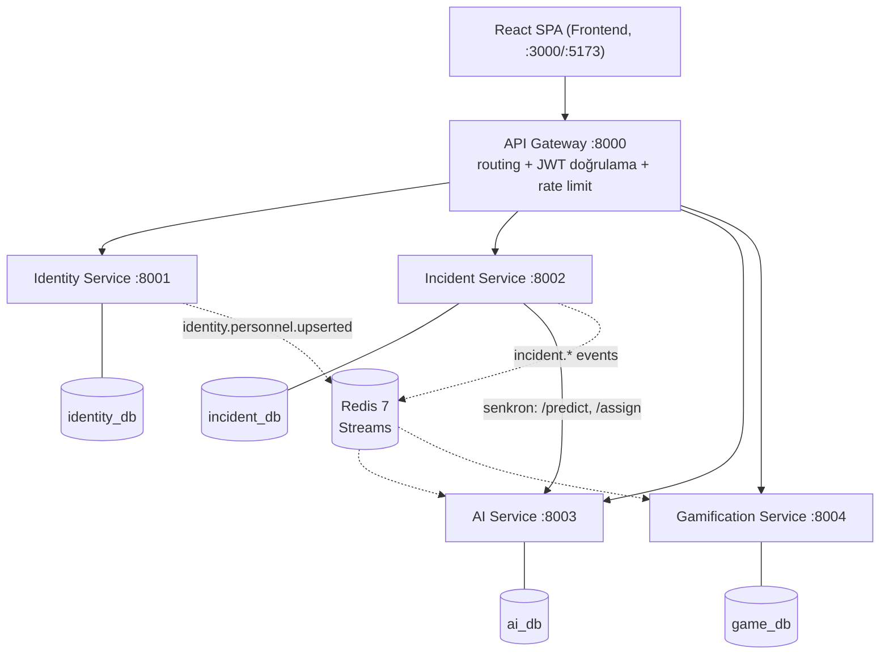

# NetOpsCell

Turkcell şebeke arıza tahmini ve saha operasyon platformu — Turkcell CodeNight 2026 Final case'i.

Baz istasyonu telemetri verisi geldiğinde yapay zeka arıza olasılığını tahmin eder, arıza türünü sınıflandırır, öncelik atar ve en uygun saha ekibine yönlendirir. Saha ekipleri arızaları çözdükçe puan/rozet kazanır, süpervizörler tüm şebeke sağlığını ve model doğruluğunu tek ekrandan izler.

## Mimari



4 bağımsız mikroservis (her biri kendi PostgreSQL veritabanına sahip — database-per-service), bir API Gateway ve Redis Streams üzerinden olay tabanlı iletişim. Detaylı mimari kararlar için [ARCHITECTURE.md](ARCHITECTURE.md), event kataloğu için [EVENTS.md](EVENTS.md), AI yaklaşımı için [docs/ai-approach.md](docs/ai-approach.md).

| Servis | Sorumluluk | Klasör |
|---|---|---|
| API Gateway | Routing, RS256 JWT doğrulama, rate limiting, `X-User-*` header enjeksiyonu | [gateway/](gateway/README.md) |
| Identity Service | Kayıt/giriş, token yönetimi, rol/yetki, audit log, hesap kilitleme | [services/identity-service/](services/identity-service/README.md) |
| Incident Service | Arıza yaşam döngüsü, SLA takibi, saha iletişimi, çözüm değerlendirmesi | [services/incident-service/](services/incident-service/README.md) |
| AI Service | Arıza tahmini (LLM + kural fallback), sınıflandırma, akıllı saha ataması | [services/ai-service/](services/ai-service/README.md) |
| Gamification Service | Puan, rozet, seviye, liderlik tablosu (event tabanlı) | [services/gamification-service/](services/gamification-service/README.md) |
| Frontend | Tüm roller için web arayüzü | [frontend/](frontend/README.md) |

## Kurulum

```bash
git clone <repo>
cd NetOpsCell
docker compose up --build -d
```

Tüm servisler ve veritabanları tek komutla ayağa kalkar. Health-check'lerin `healthy` olması birkaç dakika sürebilir (ilk build). Durumu kontrol et:

```bash
docker compose ps
```

**AI Service'in LLM yolunu (Anthropic) kullanabilmesi için** proje kökünde bir `.env` dosyasına gerçek bir API key koy:

```
ANTHROPIC_API_KEY=sk-ant-...
```

Bu olmadan sistem **çalışmaya devam eder** (diskalifiye olmaz) — otomatik olarak kural tabanlı fallback'e düşer, ama LLM tahminini görmek için key gereklidir.

Frontend: `http://localhost:3000` (Docker) ya da geliştirme için `cd frontend && npm install && npm run dev` → `http://localhost:5173` (bkz. [frontend/README.md](frontend/README.md) için `.env` ayarları).

## Demo kullanıcı bilgileri

İlk açılışta yalnızca bir **Admin** hesabı otomatik oluşturulur (identity-service `seed_admin`):

| Rol | E-posta | Şifre |
|---|---|---|
| Admin | `admin@netopscell.local` | `Admin123!` |

Diğer roller (Saha Teknisyeni, NOC Operatörü, Süpervizör) admin panelinden (`POST /auth/personnel`, Admin girişi gerektirir) oluşturulur. Saha Teknisyeni oluştururken `base_lat`/`base_lon` **zorunludur** — AI Service'in atama skorlaması (Haversine mesafe) bu alanları kullanır. Müşteri hesapları GSM + OTP ile kendiliğinden oluşur (simülasyon kodu her zaman `1234`).

## Demo senaryosu (case §11.3)

1. `docker compose up` ile sistemi ayağa kaldır
2. Admin ile gir → bir Saha Teknisyeni (uzmanlık + konum ile) oluştur
3. NOC ekranından ya da `POST /api/v1/telemetry` ile kritik telemetri gönder (sinyal çökük, sıcaklık yüksek, güç kesintide)
4. AI'ın olasılık + tür + öncelik atamasını, ardından doğru uzmanlıktaki en yakın ekibe otomatik atamasını gör
5. Teknisyen hesabıyla vakayı YOLDA → MÜDAHALE_EDİLİYOR → çözüm notuyla ÇÖZÜLDÜ'ye taşı
6. Liderlik tablosunda puanın anında yansıdığını gör
7. Bağımsızlık: `docker stop netopscell-ai-service-1` yap, sistemin geri kalanının (BELİRSİZ/ORTA fallback ile) çalışmaya devam ettiğini göster

## Ortak sözleşmeler

JWT payload şeması, `ResponseEnvelope`, standart hata kodları ve Incident↔AI istek/cevap şemaları için [docs/CONTRACTS.md](docs/CONTRACTS.md).
